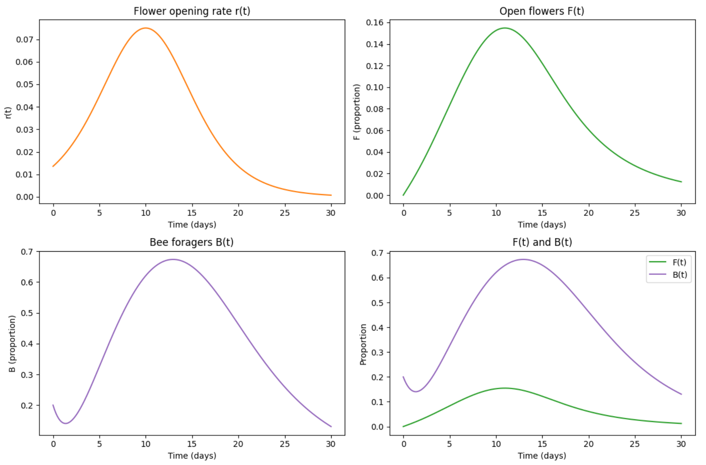

# Plant-Pollinator-Model
# Vol 4 semester 1 project
**Author:** Heidi Turley, Austin Child, Brendan Wagner, Kerby Liao  
**Date:** March 2026  

## Introduction
We are trying to model the network dynamics between blueberries and bees using a Lotka-Volterra model where the species are benefiting each other instead of eating each other. 

## Questions/Concerns
* ~~Are we wanting to pick a specific plant and pollinator to focus on or keep it general?~~
    * blueberries and bees
* ~~If we keep it general, how would we go about find our rates? Like birth and death rates, as well as the rate that interactions lead to increasing the populations of the plants and pollinators?~~
* How are we going to address the stability problems with the Lotka-Volterra model that are brought up in Vol 4 pgs 17-20?
    * ignore for now
* ~~How does carrying capacity work in this setup? Before, only the prey had a carrying capacity variable applied to them, since the prey population in and of itself was the carrying capacity of the predators. In ours though, part of it will depend on that first assumption we make that I had a question about. If we assume that the pollinators get all of their food from the plants then we would only need a carrying capacity on the plants, but if we assume otherwise then we would need to put carrying capacities on both I think.~~
* ~~Going off of that, what environment are we wanting to model? Because a farm vs a mountain meadow are going to have different carrying capacities.~~
    * blueberry farm

## Assumptions
What assumptions are we going to make to base our model off of?
Here are some thoughts:
* The bees get 100% of their food/nutrients from the blueberries
* Are we assuming that each interaction between plant and pollinator is equally beneficial to both species or that one benefits more from it then the other? Meaning one species experiences more population growth due to each interaction then the other vs them growing equally. 
    * Austin is asking his experts about this
* Growth rate really is a ratio of birth rate/death rate 

## ODE Equations

### Exponential Growth
* Variables
    * t = time
    * p(t) = population of blueberries
    * $\rho$ = growth rate of blueberries
    * $\epsilon_p$ = how beneficial each interaction is for the blueberries (how much growth comes from each interaction)
    * a = amount that each interaction leads to pollen collection/fertilization??
    * b(t) = population of bees
    * $\mu$ = growth rate of bees
    * $\epsilon_b$ = how beneficial each interaction is for the bees (how much growth comes from each interaction)

* $\dot{p}(t) = \rho p(t) + \epsilon_p a p(t) b(t)$
* $\dot{b}(t) = \mu b(t) + \epsilon_b a p(t) b(t)$

### Logistic Growth
* Variables
    * same varaibles as before with the addition of:
    * $g_p$ = carrying capacity of blueberries
* $\dot{p}(t) = \rho p(t) - g_p p^2 (t) + \epsilon_p a p(t) b(t)$
* $\dot{b}(t) = \mu b(t) + \epsilon_b a p(t) b(t)$

---

# Vol 4 Semester 1 Project
**Author:** Heidi Turley, Austin Child, Brendan Wagner, Kerby Liao  
**Date:** March 2026  

## Introduction
We are trying to model the network dynamics between blueberry pollen and honey bees. Specifically, we want to see what would happen to the blueberries as the availability of worker bees fluctuates (because of global warming, for example). The direction of the project will be shaped by how well we actually hammer out some of the details.

## Specifics
* We're going to focus on Highbush Blueberries and standard honey bees. This allows us to use Austin's articles that he has found to find specific growth and pollination constants. 
* These blueberry bushes have about a 3-week span in the season in which all of their flowers open for pollination (and they close in about 4 days if they do not get pollinated). We will use a basic logistic equation centered at 10 days with a constant $k=0.5$, though $k$ is subject to change.
* We want to track the number of bees that are "foraging" (working). The number will increase as there are more flowers that are ready to be pollinated, and decrease as the flowers start to close.
* If we have the time and bandwidth, one idea is to see how these actually convert to berries. That might be difficult.

## ODE Equations
* Variables
    * $t$ = time
    * $F(t) =$ proportion of "open" blueberry blossoms (flowers)
    * $B(t) =$ number (proportion?) of foraging honey bees
    * $h =$ half-saturation constant (probably 0.5)
    * $\alpha =$ "attraction rate" (how much the bees will forage based on how many flowers are out). Default value will be 1
    * $\mu_F =$ closing rate of flowers (around 0.25)
    * $\mu_B =$ worker bee departure rate. Default at 1
    * $\sigma =$ the pollination rate, that is, how quickly a flower will close proportional to the number of open flowers and the number of foraging bees. Defaulted to 1.
    * $r(t) =$ the derivative of the logistic equation, which we found to be:
        $$\frac{ke^{-k(x-10)}}{\left( 1+e^{-k(x-10)} \right)^2}$$

All together we get the master equations:
$$\frac{dF}{dt} = r(t) - \mu_F F - \sigma B F$$
$$\frac{dB}{dt} = \alpha \frac{F}{F+h} - \mu_B B$$

We're working on slapping together some code that we'll put in a shared folder. I think Austin's close to getting that.

## Action Plan
The next steps are:
* Get the code working and distributed
* Work to find constants based on actual real-life data
* Refine equations
* Make presentation on findings
* If we have time, experiment with different bee populations (based on foraging bee amount)

## Our Code
This is what we have so far:

## Articles
These articles are pretty much providing all of our reference data.
* https://link.springer.com/article/10.1007/s10980-022-01562-1
* https://academic.oup.com/jee/article/118/1/282/7888869
* https://www.frontiersin.org/journals/sustainable-food-systems/articles/10.3389/fsufs.2022.1006201/full
* https://besjournals.onlinelibrary.wiley.com/doi/full/10.1111/1365-2435.70269
